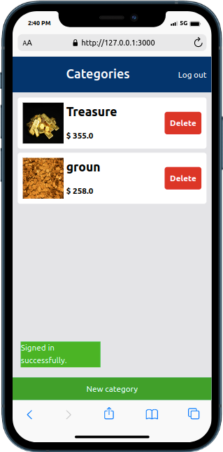

# Budget App

Budget-App is about building a mobile web application where you can manage your budget: you have a list of transactions associated with a category, so that you can see how much money you spent and on what.

# Built With
 - Ruby on Rails
 - CSS

# presentation

- [loom link ](https://www.loom.com/share/ad83678bc40c4a3382b01bf818d55a55)

# Live Demo
  - [budget-app](https://render-e-pay.onrender.com/)

# Screenshots
     

# Testing Tools
  1. Rubocop
  2. Stylelint

  # Dependencies installation
  1. gem rails
  2. gem devise
  3. gem rspec

# Getting Started
To get local copy of the project and run

1. ``git clone https://github.com/moise-mulungu/Budget_app``
2. ``cd budget-app``
3. ``gem install bundler``
4. ``bundle install``
5. ``rails s``

## Database Setup
Setup db

1. ``su - postgres``
2. ``psql``
3. ``create role budget with createdb login password 'budget'``
4. ``rails db:setup``
5. ``rails db:create``

# Tests

1. ``bundle exec rspec``
2. ``rubocop``

## Author

👤 **Moise Mulungu**

- GitHub: [@moise-mulungu](https://github.com/moise-mulungu)
- Twitter: [@moise_mulungu](https://twitter.com/moise_mulungu)
- LinkedIn: [Moïse (Musa) Mulungu](https://www.linkedin.com/in/moisemulungu/) 

## 🤝 Contributing

Contributions, issues, and feature requests are welcome!

Feel free to check the [issues page](https://github.com/moise-mulungu/Budget_app/issues).

## Show your support

Give a ⭐️ if you like this project!

## Acknowledgments

- Microverse: [microverse community](https://github.com/microverseinc)
- [Gregoire Vella on Behance](https://www.behance.net/gregoirevella)

## 📝 License

This project is [MIT](./MIT.md) licensed.